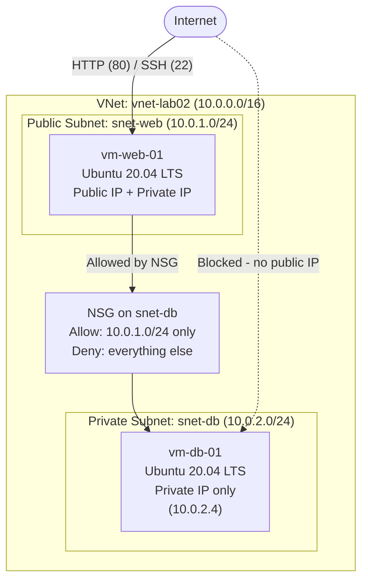
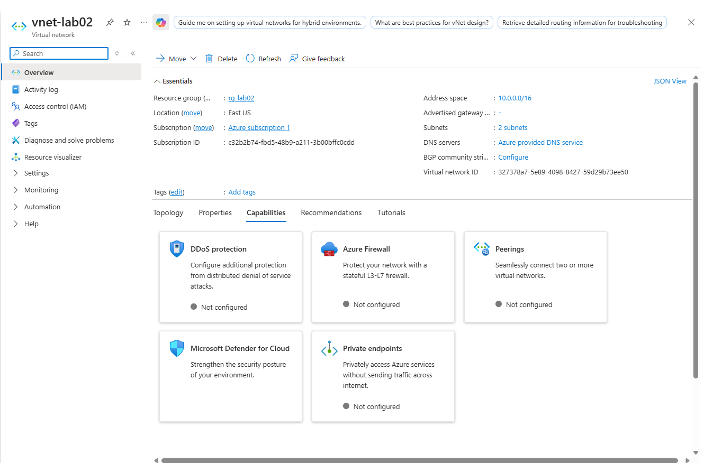
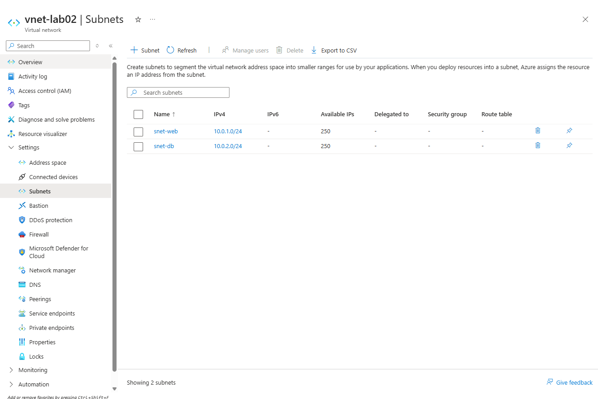
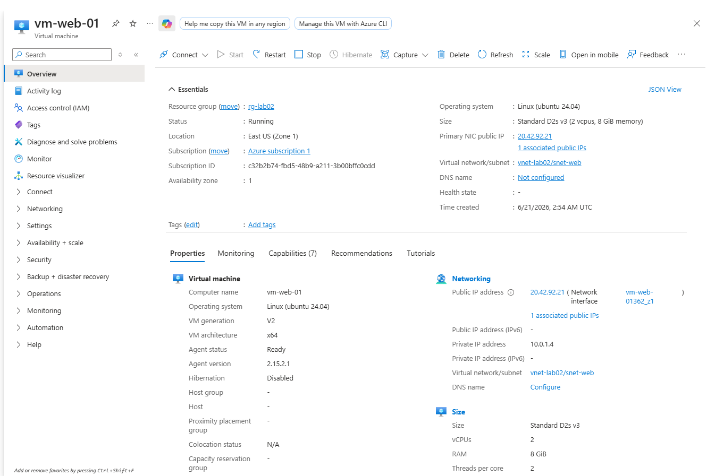
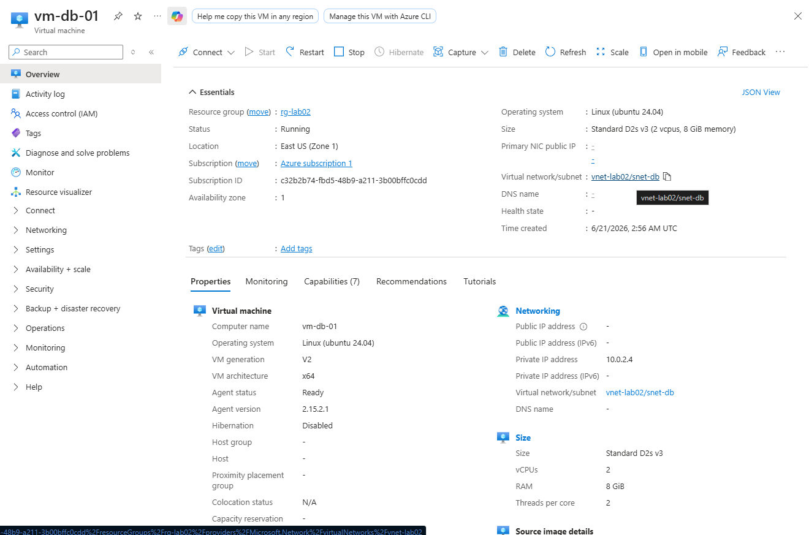
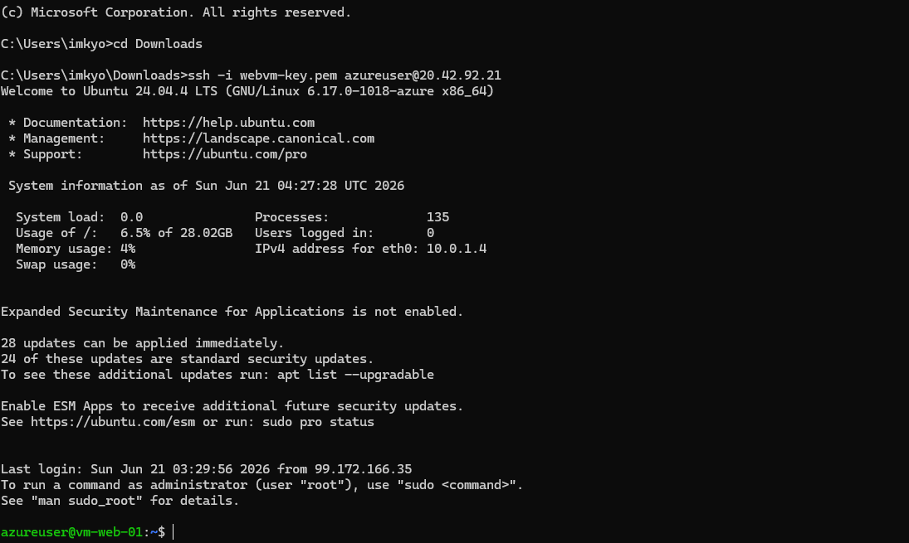
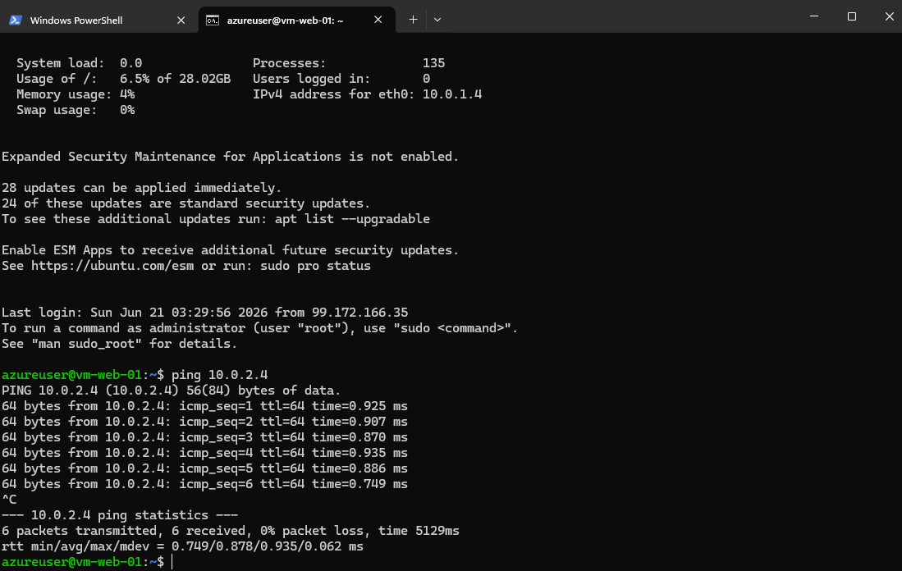
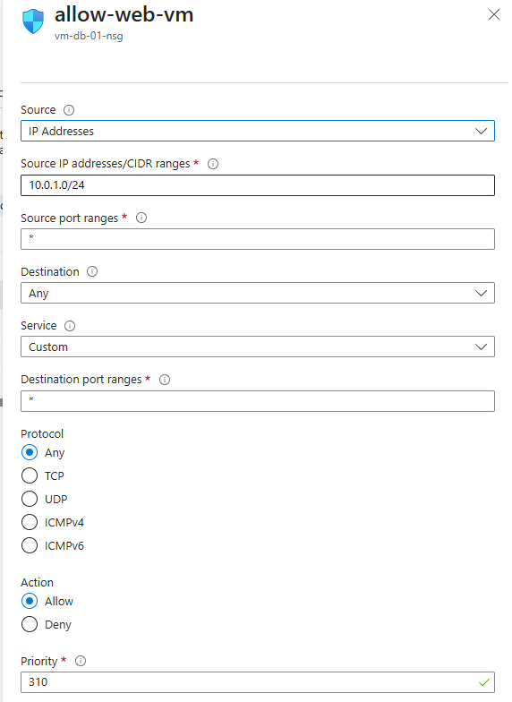
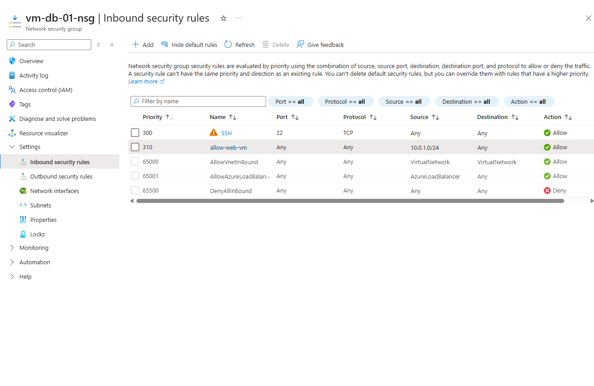
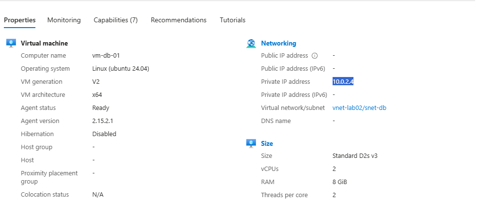

# Secure 2-Tier Web Application on Azure
 


 
A hands-on implementation of a classic **IaaS two-tier architecture** on Microsoft Azure: a public-facing web server isolated from a private database server using subnet segmentation and Network Security Group (NSG) rules. This project demonstrates core cloud networking and security concepts — VNet design, subnetting, NSG rule authoring, and the principle of least-privilege network access.
 
---
 
## Table of Contents
 
- [Overview](#overview)
- [Architecture](#architecture)
- [Tools & Technologies](#tools--technologies)
- [Resource Naming Convention](#resource-naming-convention)
- [Repository Structure](#repository-structure)
- [Prerequisites](#prerequisites)
- [Build Walkthrough](#build-walkthrough)
  - [Phase 1: Network Foundation](#phase-1-network-foundation)
  - [Phase 2: Deploying the Web Server](#phase-2-deploying-the-web-server)
  - [Phase 3: Deploying the Database Server](#phase-3-deploying-the-database-server)
  - [Phase 4: Validating Connectivity](#phase-4-validating-connectivity)
  - [Phase 5: Locking Down the Firewall (NSG)](#phase-5-locking-down-the-firewall-nsg)
- [Security Design Notes](#security-design-notes)
- [Troubleshooting Log](#troubleshooting-log)
- [Cleanup](#cleanup)
- [Skills Demonstrated](#skills-demonstrated)
- [Future Improvements](#future-improvements)
---
 
## Overview
 
This project provisions a two-tier network topology in Azure consisting of:
 
- A **public subnet** hosting a web server (`vm-web-01`) reachable from the internet over HTTP and SSH.
- A **private subnet** hosting a database server (`vm-db-01`) with **no public IP**, reachable only from inside the virtual network.
- A **Network Security Group** on the database subnet that explicitly allows traffic only from the web subnet's CIDR range, enforcing a deny-by-default security posture for everything else.
The goal was to replicate a real-world pattern used to protect backend data tiers from direct internet exposure — the same principle behind production app-tier/data-tier separation.
 
---
 
## Architecture
 

 
 
| Component | Value |
|---|---|
| Resource Group | `rg-lab02-[yourname]` |
| Virtual Network | `vnet-lab02` — `10.0.0.0/16` |
| Public Subnet | `snet-web` — `10.0.1.0/24` |
| Private Subnet | `snet-db` — `10.0.2.0/24` |
| Web VM | `vm-web-01` (Public + Private IP) |
| DB VM | `vm-db-01` (Private IP only — `10.0.2.4`) |
| Region | East US |
 
---
 
## Tools & Technologies
 
- **Microsoft Azure** — Virtual Networks, Subnets, Network Security Groups, Virtual Machines
- **Ubuntu Server 20.04 LTS**
- **SSH** for remote administration
- **Azure Portal** (manual / click-ops deployment)
---
 
## Resource Naming Convention
 
| Resource | Name | Notes |
|---|---|---|
| Resource Group | `rg-lab02-[yourname]` | Replace `[yourname]` with your identifier |
| VNet | `vnet-lab02` | Address space `10.0.0.0/16` |
| Public Subnet | `snet-web` | `10.0.1.0/24` |
| Private Subnet | `snet-db` | `10.0.2.0/24` |
| Web VM | `vm-web-01` | `Standard_B1s`, key pair `key-lab02` |
| DB VM | `vm-db-01` | `Standard_B1s`, no public IP |
 
---
 
## Repository Structure
 
```
.
├── README.md
└── screenshots/
    ├── 01-vnet-creation-basics.png
    ├── 02-vnet-subnet-config.png
    ├── 03-webvm-basics.png
    ├── 04-webvm-networking.png
    ├── 05-webvm-overview-publicip.png
    ├── 06-dbvm-networking-subnet.png
    ├── 07-dbvm-no-publicip.png
    ├── 08-dbvm-private-ip.png
    ├── 09-ssh-into-webvm.png
    ├── 10-ping-success.png
    ├── 11-nsg-inbound-rules-before.png
    ├── 12-nsg-allow-web-rule-form.png
    ├── 13-nsg-inbound-rules-after.png
```
 
 

 
---
 
## Prerequisites
 
- [ ] Active Azure Subscription
- [ ] Basic familiarity with Azure networking concepts
- [ ] A terminal with SSH client installed (Terminal, PowerShell, or WSL)
---
 
## Build Walkthrough
 
### Phase 1: Network Foundation
 
Created the Virtual Network with two subnets — one for each tier.
 
1. Navigate to **Virtual Networks → Create**.
2. **Basics:** New Resource Group `rg-lab02-[yourname]`, name `vnet-lab02`, region East US.
3. **IP Addresses:** Address space `10.0.0.0/16`.
   - `snet-web` → `10.0.1.0/24`
   - `snet-db` → `10.0.2.0/24`
4. **Review + create → Create**.

> The "IP Addresses" tab showing both subnets (`snet-web` and `snet-db`) with their CIDR ranges configured side by side.
 
### Phase 2: Deploying the Web Server
 
Deployed the public-facing front-end VM into the public subnet.
 
1. **Virtual Machines → Create.**
2. **Basics:** Name `vm-web-01`, image Ubuntu Server 20.04 LTS, size `Standard_D2s_v3`, key pair `key-lab02`.
3. **Inbound ports:** Allow HTTP (80) and SSH (22).
4. **Networking:** Subnet set to `snet-web`; Public IP set to Create New (Standard).
5. **Review + create → Create**, download the `.pem` private key.
> **📸 Screenshot — `04-webvm-basics.png`**
> The "Basics" tab showing VM name, image, size, and key pair selection.
 

> The "Networking" tab confirming `snet-web` is selected and a new Public IP is being created.
 
### Phase 3: Deploying the Database Server
 
Deployed the back-end VM into the private subnet — the critical step, since this VM intentionally receives **no public IP**.
 
1. **Virtual Machines → Create.**
2. **Basics:** Name `vm-db-01`, same image/size, reuse key pair `key-lab02`.
3. **Inbound ports:** Allow only SSH (22) — no HTTP needed on the DB tier.
4. **Networking (critical step):** Virtual Network `vnet-lab02`, Subnet changed to **`snet-db`**, Public IP set to **None**.
5. **Review + create → Create**.
 

> The same Networking tab with the Public IP field set to **None**, clearly visible — this is the core security control of the whole architecture.
 

> The deployed `vm-db-01` Overview page showing only a Private IP address (`10.0.2.4`) and no Public IP field populated.
 
### Phase 4: Validating Connectivity
 
Because `vm-db-01` has no public IP, it can't be reached directly from a home network. The web server is used as a **jump host** to reach it.
 
1. Retrieve the DB server's private IP (`10.0.2.4`) from its Overview page.
2. SSH into the web server using its public IP:
```bash
   ssh -i key-lab02.pem azureuser@<public-ip-of-web>
```
3. From inside the web server, test connectivity to the DB server:
```bash
   ping 10.0.2.4
```
4. Successful replies confirm both VMs are reachable within the VNet. `Ctrl+C` to stop.

> Terminal showing the successful SSH login banner into `vm-web-01` (redact/blur the public IP if you want to keep it private).
 

> Terminal output showing successful `ping 10.0.2.4` replies from inside the web server — this is the proof of cross-tier connectivity inside the VNet.
 
### Phase 5: Locking Down the Firewall (NSG)
 
At this point the DB server is reachable from anywhere inside the VNet — too permissive. This phase scopes access down to only the web subnet.
 
1. Go to `vm-db-01` → **Networking** tab → open its **Network Security Group**.
2. **Inbound security rules → + Add.**
3. Create the **Allow-Web-Subnet** rule:
   | Field | Value |
   |---|---|
   | Source | IP Addresses |
   | Source IP / CIDR | `10.0.1.0/24` |
   | Source port ranges | `*` |
   | Destination | Any |
   | Service | Custom |
   | Destination port ranges | `*` (or `3306`/`5432` for a real DB) |
   | Action | Allow |
   | Priority | 100 |
   | Name | `Allow-Web-Subnet` |
4. Click **Add**.

> The "Add inbound security rule" form fully filled out, matching the table above.
 

> The Inbound security rules list *after* the `Allow-Web-Subnet` rule is added, with its priority (100) and source range (`10.0.1.0/24`) visible.
 
---
 
## Security Design Notes
 
- **No public IP on the data tier** is the primary control — even without any NSG rules, `vm-db-01` is unreachable from the internet by default because Azure has no path to it.
- **Defense in depth:** the NSG rule is a secondary, explicit control that scopes inbound access to exactly the web subnet's CIDR block (`10.0.1.0/24`), rather than relying solely on the absence of a public IP.
- **Principle of least privilege:** the rule allows the minimum necessary source range and could be tightened further to a specific destination port (e.g., `3306` for MySQL or `5432` for PostgreSQL) once a real database engine is installed.
- **Jump host pattern:** using `vm-web-01` as the only entry point into the private subnet mirrors how bastion hosts/jump boxes are used in production environments to avoid exposing backend systems directly.
---
 
## Troubleshooting Log
 
| Issue | Cause | Fix |
|---|---|---|
| Ping to `10.0.2.4` fails | `vm-db-01` deployed into the wrong subnet, or VMs in different VNets | Confirm `vm-db-01` is in `snet-db` and both VMs share `vnet-lab02` |
| Can't SSH directly into `vm-db-01` from local machine | No public IP assigned (by design) | SSH into `vm-web-01` first, then reach the DB server from there |
 
---
 
## Cleanup
 
To avoid ongoing Azure charges, delete the entire resource group once finished:
 
```text
Delete rg-lab02-[yourname]
```
 
Deleting the resource group removes the VNet, both VMs, NSGs, and associated disks/IPs in one action.
 

> The resource group's "Delete resource group" confirmation dialog, showing all resources slated for deletion.
 
---
 
## Skills Demonstrated
 
- Azure Virtual Network design and subnetting (CIDR planning)
- Public vs. private resource exposure (controlling Public IP assignment)
- Network Security Group rule authoring and prioritization
- Cross-subnet connectivity validation via SSH jump host pattern
- Defense-in-depth network security principles
---
 
## Future Improvements
 
- [ ] Convert this manual build into **Terraform** for repeatable, version-controlled deployment
- [ ] Replace the SSH jump-host pattern with **Azure Bastion** for a fully public-IP-free management plane
- [ ] Install an actual database engine (e.g., PostgreSQL) and tighten the NSG rule to its specific port
- [ ] Add an **Application Security Group (ASG)** in place of raw CIDR ranges for more maintainable rules
- [ ] Add a Network Security Group on the web subnet as well, scoping it to only HTTP/SSH
- [ ] Layer in Azure Monitor / NSG Flow Logs for traffic visibility
 

